<p align="center"><a href="http://file-reader.nethuby.com/" target="_blank"></a></p>

# File reader powerd by ( Ahmed abd el salam )

####  You can read almost any file except Microsoft family files.
###### but make sure the file has read permission.

## This Project build with Quasar CLI.
####  Quasar CLI is the pride of Quasar Framework. You can seamlessly build:
- **a SPA (Single Page Application/Website),**
- **a SSR (Server-side Rendered App/Website),**
- **a PWA (Progressive Web App),**
- **a BEX (Browser Extensions),**
- **a Mobile App (through Cordova)**
- **an Electron App**

## Requirements:

- **Node 12+ for Quasar CLI with Webpack, Node 14+ for Quasar CLI with Vite.**
- **Yarn v1 (strongly recommended) or NPM.**

### Install Quasar if not installed
```bash
$ yarn global add @quasar/cli
$ yarn create quasar

# or:

$ npm i -g @quasar/cli
$ npm init quasar
```

### Install the dependencies

```bash
$ npm install
```

### Start the app in development mode (hot-code reloading, error reporting, etc.)

```bash
$ quasar dev
```

### Don't forget to add your domain in src/boot/axios.js
#### Now you can switch between local and serve url.

```bash
const local = 'http://127.0.0.1:8000/api/'
const serve = 'http://143.198.169.92/api/'
const url = local
```

### Build the app for production

```bash
$ quasar build
```

### After installing dependencies you can login with

```bash
Username : admin
Password : admin
```

